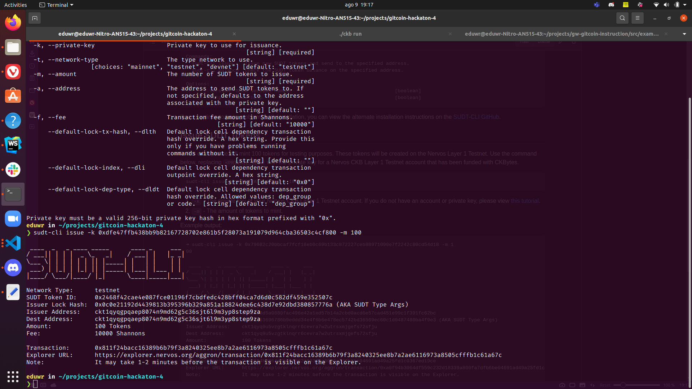
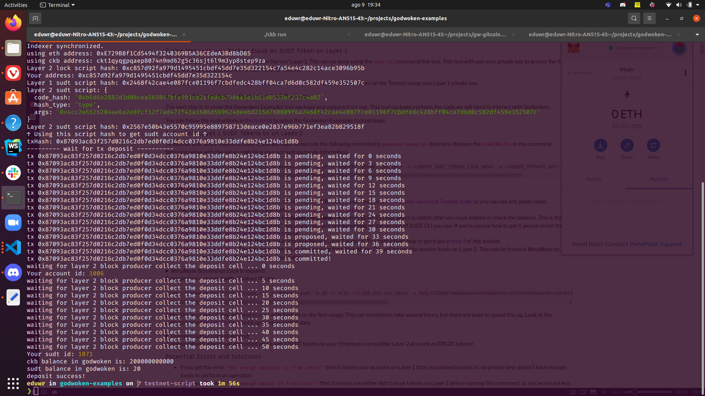

# gitcoin-hackaton-4

## A link to the Layer 1 address you funded on the Testnet Explorer.

https://explorer.nervos.org/aggron/address/ckt1qyqgpqaep8074n9md62g5c36sjt6l9m3yp8step9za

[click here](https://explorer.nervos.org/aggron/address/ckt1qyqgpqaep8074n9md62g5c36sjt6l9m3yp8step9za)

## A screenshot of the console output immediately after using sudt-cli to create your SUDT tokens on Layer 1.

## A link to the transaction ID created by sudt-cli on the Testnet Explorer.

https://explorer.nervos.org/aggron/transaction/0x811f24bacc16389b6b79f3a8240325ee8b7a2ae6116973a8505cfffb1c61a67c

[link to the transaction](https://explorer.nervos.org/aggron/transaction/0x811f24bacc16389b6b79f3a8240325ee8b7a2ae6116973a8505cfffb1c61a67c)

## A screenshot of the console output immediately after you have successfully submitted a deposit to Layer 2 using the account-cli tool.

## The SUDT ID from the console output after executing the deposit script (in text format).

1071
